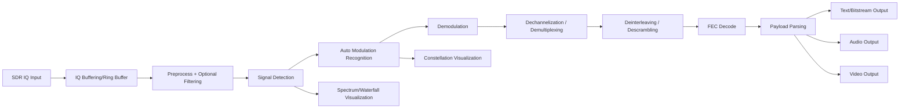

# SingalAnalys-Pro

SingalAnalys-Pro is a real-time RF spectrum analysis application for SDR (Software Defined Radio), built with Python, PySide6, and PyQtGraph.

It combines real-time visualization with a DSP pipeline that can detect, classify, demodulate, decode, and present signal outputs (for example, bitstream text data now, with a clear path to audio/video pipelines).

## 1. Project Purpose

This project is designed to:

- Observe RF spectrum activity in real time.
- Analyze and interpret captured RF signals end-to-end.
- Provide a practical DSP experimentation platform for SDR research and engineering workflows.
- Run with real hardware or synthetic/demo data for development and validation.

## 2. Core Features

### 2.1 Real-Time Visualization

- FFT Spectrum view
- Waterfall time-frequency view
- Constellation diagram view
- Bitstream visualization

### 2.2 Signal Processing Pipeline

- Modulation analysis and demodulation
- Encoding/coding analysis and decoding
- Signal detection and TDMA burst analysis
- Performance modes and adaptive throttling

### 2.3 SDR Backend Support

- `spyserver` (primary runtime backend)
- `rtlsdr`, `hackrf`, `pluto`, `soapy`, `usrp` (status varies by backend readiness)
- Graceful fallback behavior when optional libraries are unavailable

### 2.4 Recent Performance and Stability Upgrades

- Acquisition and processing moved to separate worker threads
- Bounded latest-wins queue for backpressure
- Ring buffers for IQ snapshots and bitstream buffering
- Async analysis request path (non-blocking UI)
- QoS profiles: `fast`, `balanced`, `quality`

## 3. Standardized End-to-End Processing Flow

This section defines the normalized processing flow from RF input to end output.

### 3.1 Canonical Flow

1. RF Capture Input:
	SDR backend acquires complex IQ samples.
2. Ingest and Buffering:
	IQ chunks are added to bounded/ring buffers.
3. Preprocessing:
	Normalization/windowing, optional filtering, and frame selection.
4. Detection Stage:
	Signal/noise decision and burst/energy detection.
5. Auto Characterization Stage:
	Estimate likely modulation family and key parameters.
6. Demodulation Stage:
	Recover baseband symbols/bit candidates.
7. Dechannelization / Demultiplexing Stage:
	Separate channels/streams when multiplexing is present.
8. Deinterleaving / Descrambling Stage:
	Reverse interleaver/scrambler if detected.
9. FEC Decoding Stage:
	Decode channel coding and recover payload bits.
10. Payload Parsing Stage:
	 Convert payload bits into structured outputs.
11. Output Rendering Stage:
	 Present results as text, bitstream, constellation, and application-specific outputs (audio/video when protocol handlers exist).

### 3.2 Signal Flow Diagram



### 3.3 Practical Decode Pipeline (Detailed Step-by-Step)

This is the recommended operational workflow to decode satellite or general RF signals in real projects.

1. Define target and initial hypotheses

- Identify center frequency, expected bandwidth, and likely service class (telemetry, voice, digital data, beacon, broadcast).
- Build initial modulation/FEC hypotheses (for example BPSK/QPSK/FSK/OFDM and rough symbol rate).
- Define legal/operational constraints before decoding any payload.

2. Capture signal at RF front-end

- Use antenna and RF chain matched to the band (plus LNA/LNB where required).
- Set SDR sample rate high enough to cover occupied bandwidth with guard margin.
- Tune gain to avoid clipping while keeping noise floor visible.
- Record raw IQ when possible for reproducible offline analysis.

3. Preprocess IQ stream

- Shift signal to baseband and isolate channel with suitable bandwidth filter.
- Normalize amplitude and apply AGC where needed.
- Correct DC offset and IQ imbalance if front-end artifacts are visible.
- Optionally apply decimation after anti-alias filtering to reduce compute load.

4. Detect signal and synchronize

- Detect signal presence using energy and/or correlation methods.
- Correct carrier frequency offset (CFO) and long-term drift.
- Recover symbol timing (clock recovery loop).
- Lock to frame/preamble/sync word.

5. Demodulate

- Select demodulator from recognition output, or run candidate sweep if confidence is low.
- Prefer soft decisions (LLR) when downstream decoder supports them.
- Output symbols/soft bits and quality indicators (EVM, SNR proxy, lock confidence).

6. Channel decode (FEC + ordering recovery)

- Apply FEC decoder according to the best current hypothesis (Viterbi, RS, LDPC, Turbo, etc.).
- Apply deinterleaving where present.
- Apply descrambling/derandomization where present.
- Track decoder confidence and syndrome/CRC-related indicators for each block.

7. Decode protocol/data layer

- Deframe payload (AX.25, CCSDS, DVB, custom framing, and others).
- Parse header and payload fields, then validate CRC/checksum/sequence continuity.
- Reassemble fragmented packets/frames into complete higher-layer units.

8. Convert into useful outputs

- Text/telemetry: structured fields, logs, CSV/JSON export.
- Audio: PCM/codec decode, monitor/playback, save as WAV or stream.
- Video/image: elementary stream decode, packet reassembly, container or image product generation.

9. Validate results

- Track BER/PER, CRC pass rate, frame loss, lock duration, and SNR margin.
- Cross-check decoded fields against known constants (timestamp ranges, IDs, message structure).
- Reject false-positive decodes by consistency rules over multiple frames.

10. Optimize in a closed loop

- Retune gain, filter bandwidth, loop bandwidth, PLL parameters, and frame thresholds.
- Auto-select modulation/FEC/profile using confidence and historical decode success.
- Persist best-known profile per signal type for faster reacquisition.

11. Minimum required telemetry per processing stage

- Capture stage: RSSI/noise floor, clipping events.
- Sync stage: CFO estimate, timing error, lock state.
- Demod stage: modulation confidence, EVM-like metric, soft-bit quality.
- Decode stage: block error count, CRC pass ratio, average retry count.
- Output stage: message throughput, reassembly latency, payload integrity status.

12. Failure handling strategy (must-have)

- Keep top-N hypotheses active instead of single hard decision.
- Fallback to previous stable profile when lock degrades.
- Separate "no signal", "sync lost", "decode failed", and "parse failed" as distinct error classes.
- Always keep raw IQ snapshot windows to support post-mortem debugging.

## 4. Feature-Specific Flows

### 4.1 Auto Modulation Recognition

Goal:
Infer likely modulation type and confidence before or during demodulation.

Current path:
- Uses modulation analysis modules and signal statistics.
- Produces modulation metadata shown in UI.

Target mature path:
- Multi-candidate ranking with confidence calibration.
- Model-based + rule-based hybrid inference.

### 4.2 Auto Scrambling/Coding Recognition

Goal:
Detect scrambling/interleaving/coding schemes, then apply reverse operations automatically.

Current path:
- Coding/encoding analysis exists at baseline level.
- Basic decoding chain is available.

Target mature path:
- Explicit auto-descrambler detector.
- Interleaver pattern inference and deinterleaving stage.
- Robust multi-scheme decoder fallback.

### 4.3 Auto Filter Recognition/Selection

Goal:
Automatically infer the best receive/filter strategy from observed spectrum characteristics.

Current path:
- Filter modules are available and configurable.
- No fully automatic closed-loop filter selection yet.

Target mature path:
- Adaptive filter policy based on SNR, occupancy, bandwidth estimate, and modulation confidence.

### 4.4 Demod -> Decode -> Output

Goal:
Transform IQ frames into meaningful payload outputs.

Current path:
- Demodulation and decoding are present.
- Text/bitstream style outputs are practical now.
- Constellation display is integrated.

Target mature path:
- Protocol-specific payload parsers.
- Audio decoder chain for voice waveforms.
- Video stream reconstruction for supported digital video protocols.

## 5. Current Capability Assessment

### 5.1 What the App Already Does Well

- Real-time RF visualization (spectrum + waterfall + constellation)
- Multi-backend SDR architecture with graceful degradation
- Functional DSP pipeline for analysis/demod/decode in many practical cases
- Threading and UI responsiveness significantly improved by recent refactor
- Deterministic test harness with fast/medium/integration categories

### 5.2 Steps That Need More Work

1. Dechannelization / Demultiplexing:
	Needs explicit standardized stage and APIs for multi-channel protocols.
2. Auto descrambling/deinterleaving:
	Present implicitly/partially, but not yet a fully explicit autonomous stage.
3. Auto filter recognition:
	Requires a policy engine and runtime feedback loop.
4. Protocol-aware payload extraction:
	Needed for rich output targets (audio/video) beyond generic bitstream.
5. Backend completeness:
	Some backends (notably `usrp`) still need full runtime contract completion.

### 5.3 Optimization Priorities

1. Add explicit staged pipeline contracts:
	`detect -> classify -> demod -> dechannelize -> deinterleave/descramble -> decode -> parse`.
2. Add confidence-driven branch logic:
	Candidate selection and fallback per stage.
3. Add protocol plugin layer:
	Output adapters for text/audio/video.
4. Expand integration tests:
	Include reconnect, frame drops, queue pressure, and backend failover scenarios.
5. Add observability:
	Stage-level latency, confidence, error counters, and throughput metrics.

## 6. Architecture Overview

Primary runtime path:

1. SDR backend reads IQ chunks.
2. Processing worker performs DSP stages.
3. UI receives lightweight results and updates widgets.

Key files:

- `main.py`: CLI entrypoint and app bootstrap
- `rf_spectrum_analyzer/core/app.py`: orchestration, threading, runtime flow
- `rf_spectrum_analyzer/core/sdr_backend.py`: backend manager and abstraction
- `rf_spectrum_analyzer/core/signal_processor.py`: DSP processing pipeline
- `rf_spectrum_analyzer/dsp/*`: specialized DSP components
- `rf_spectrum_analyzer/gui/*`: UI widgets and interactions

## 7. Environment Requirements

- OS: Windows / Linux / macOS
- Python: >= 3.8 (recommended 3.10+)
- GUI: PySide6, PyQtGraph
- DSP core: NumPy, SciPy

Current top-level dependencies (from `requirements.txt`):

- `uhd`
- `numpy`
- `scipy`
- `pyqtgraph`
- `PySide6`
- `scikit-learn`
- `PyYAML`
- `sdrconnect`
- `sdr`
- `scikit-dsp-comm` (installed from `https://github.com/mwickert/scikit-dsp-comm`)

Notes:

- Some dependencies are backend-specific/optional in practice.
- For headless CI/testing, use `QT_QPA_PLATFORM=offscreen`.

## 8. Installation

### 8.1 Create Virtual Environment

Windows PowerShell:

```powershell
python -m venv .venv
Set-ExecutionPolicy -Scope Process -ExecutionPolicy RemoteSigned
.\.venv\Scripts\Activate.ps1
```

Linux/macOS:

```bash
python -m venv .venv
source .venv/bin/activate
```

### 8.2 Install Dependencies

```bash
pip install -r requirements.txt
pip install -r rf_spectrum_analyzer/requirements.txt
```

Optional direct installation for `scikit-dsp-comm` from source:

```bash
pip install git+https://github.com/mwickert/scikit-dsp-comm.git
```

## 9. Running the App

Basic:

```bash
python main.py
```

Demo mode:

```bash
python main.py --demo
```

Example with explicit runtime parameters:

```bash
python main.py --device spyserver --frequency 100e6 --sample-rate 2.4e6 --gain 20 --debug
```

CLI options:

- `--debug`
- `--config`
- `--device`
- `--sample-rate`
- `--frequency`
- `--gain`
- `--demo`

## 10. Testing

Main test runner:

```bash
python rf_spectrum_analyzer/tests/run_tests.py --fast
python rf_spectrum_analyzer/tests/run_tests.py --category medium --ci
python rf_spectrum_analyzer/tests/run_tests.py --module integration --ci
```

Headless example (Windows PowerShell):

```powershell
$env:QT_QPA_PLATFORM='offscreen'
python rf_spectrum_analyzer/tests/run_tests.py --category medium --ci
```

## 11. Roadmap

### 11.1 Completed

- Runtime pipeline refactor for UI safety and responsiveness
- Backpressure control and ring buffer strategy
- Async snapshot analysis request path
- Render throttling and QoS profiles

### 11.2 In Progress

- Broader schema/contract test coverage
- Integration hardening for reconnect/disconnect behavior

### 11.3 Next

- Full `usrp` backend contract completion
- Explicit dechannelization/deinterleaving stages
- Protocol-specific output adapters (text/audio/video)
- Expanded stage-level observability and profiling

### 11.4 Gap Analysis: App vs Canonical RF/Satellite Decode Flow

The table below compares the standardized flow in Section 3 with current project status.

1. RF capture and buffering:
	 Implemented. Worker threads, bounded queues, and ring buffers are in place.
2. Preprocessing and filtering:
	 Partially implemented. Core filtering exists, but adaptive auto-filter policy is not complete.
3. Detection and burst finding:
	 Implemented at baseline. Needs stronger confidence scoring for weak/mobile channels.
4. Auto modulation recognition:
	 Partially implemented. Basic classification exists, but multi-candidate ranking is missing.
5. Demodulation:
	 Implemented for key modes. Needs broader protocol-tuned demod blocks and test vectors.
6. Dechannelization and demultiplexing:
	 Gap. No fully explicit generic stage yet for multi-carrier/multi-slot systems.
7. Deinterleaving and descrambling:
	 Gap. Some logic exists indirectly, but no robust auto-stage with clear APIs.
8. FEC decoding:
	 Partially implemented. Basic decode path is present, but needs stronger coverage for satellite-specific chains.
9. Payload parsing:
	 Gap for many protocols. Current app is strong at signal-level analysis but parser coverage is limited.
10. Output adapters (text/audio/video):
		Text and bitstream are practical now. Audio/video protocol adapters are still future work.

### 11.5 Mission-Critical Features Required for "Decode Any RF Signal"

To approach the goal of decoding most satellite and terrestrial RF sources, these features are mandatory:

- Unified staged pipeline contract:
	`capture -> preprocess -> detect -> classify -> demod -> dechannelize -> deinterleave/descramble -> FEC decode -> parse -> output`.
- Confidence-driven decision engine:
	Keep top-N hypotheses and dynamically switch by quality metrics.
- Adaptive synchronization block:
	CFO, symbol timing, frame sync, Doppler compensation, drift tracking.
- Adaptive filter and bandwidth policy:
	Automatic filter profile selection from SNR, occupancy, and modulation confidence.
- Protocol plugin framework:
	Independent parser/decoder plugins for NOAA, Meteor, Inmarsat, Iridium, ADS-B, AIS, and custom telemetry.
- FEC and interleaver library expansion:
	Strong support for Viterbi, RS, LDPC, Turbo, convolutional variants, and interleaver families.
- Dechannelization engine:
	Multi-channel extraction for TDM/FDMA/TDMA style systems.
- Output adapters:
	Text frames, audio sink, video/image sink, pcap/JSON export.
- Verification and observability:
	BER, CRC pass ratio, frame lock duration, stage latency, decode throughput.

### 11.6 Protocol Checklists for Common Real-World Cases

The following are practical operation checklists to make implementation goals explicit.

#### NOAA APT (Analog Weather Image)

- Step 1: Acquire VHF APT pass with correct center frequency and stable gain.
- Step 2: Apply FM demod chain and audio baseband extraction.
- Step 3: Band-limit to APT subcarrier region and perform line synchronization.
- Step 4: Build image lines, calibrate contrast, and map channels.
- Step 5: Export image product and metadata.

Required app additions:

- Dedicated FM-to-APT decode preset.
- APT line sync detector and image renderer.
- Pass-oriented workflow and final image export templates.

#### Meteor LRPT (Digital Weather Image)

- Step 1: Capture stable IQ around LRPT downlink with adequate SNR.
- Step 2: Perform QPSK/OQPSK demod with robust timing and carrier recovery.
- Step 3: Frame sync + deinterleave + FEC decode according to LRPT chain.
- Step 4: Parse packets and reconstruct image segments.
- Step 5: Compose final image products and quality report.

Required app additions:

- Protocol-specific LRPT demod/decode module.
- Strong deinterleaver and FEC chain validation.
- Image segment reassembly and integrity scoring.

#### Inmarsat (L-band, Mixed Data Services)

- Step 1: Capture narrowband channels in L-band with high front-end stability.
- Step 2: Detect active carriers and classify modulation candidates.
- Step 3: Run channel demod and protocol framing.
- Step 4: Apply descramble/FEC and parse service-specific messages.
- Step 5: Output decoded text/messages and timeline view.

Required app additions:

- Multi-channel scanner/dechannelizer for narrow carriers.
- Better auto-modulation ranking for crowded spectrum.
- Inmarsat protocol parser plugins and message dictionaries.

#### Iridium (L-band Burst Channels)

- Step 1: Capture burst-heavy channels with high temporal resolution.
- Step 2: Perform burst detection and short-frame synchronization.
- Step 3: Demodulate bursts, then apply deinterleave/FEC decode chain.
- Step 4: Parse control and payload fields by burst type.
- Step 5: Export burst logs, geospatial metadata, and decoded payload where legal and supported.

Required app additions:

- High-performance burst detector and burst scheduler.
- Robust short-frame sync and decode retry logic.
- Iridium frame parser plugins with strict validation metrics.

### 11.7 Delivery Plan by Milestone

Milestone A: Pipeline Foundation

- Finalize explicit staged contracts and stage-by-stage metrics.
- Complete backend runtime compatibility matrix.

Milestone B: Auto Intelligence Layer

- Add confidence-ranked modulation/coding/filter selection.
- Add adaptive sync and Doppler-aware tuning helpers.

Milestone C: Protocol Verticals

- Ship NOAA APT full chain.
- Ship Meteor LRPT decode chain.
- Ship Inmarsat baseline parser set.
- Ship Iridium burst analysis baseline.

Milestone D: Output and Productization

- Unified output adapters: text/audio/video/image.
- Session export, replay, and reproducibility tooling.
- End-to-end QA suite with protocol fixtures and golden outputs.

## License

This project is licensed under MIT License.

See `LICENSE` for full text.

## 13. Author

- Copyright holder: Pham Cong Che
- Copyright year: 2025

## 14. Contributing

Contributions are welcome for:

- DSP pipeline accuracy and robustness
- Additional SDR backend support
- Performance tuning and profiling
- Testing, CI, and documentation improvements

Suggested workflow:

1. Create a feature branch.
2. Keep commits focused and reviewable.
3. Run tests before opening a PR.
4. Describe validation steps and expected behavior changes in the PR.