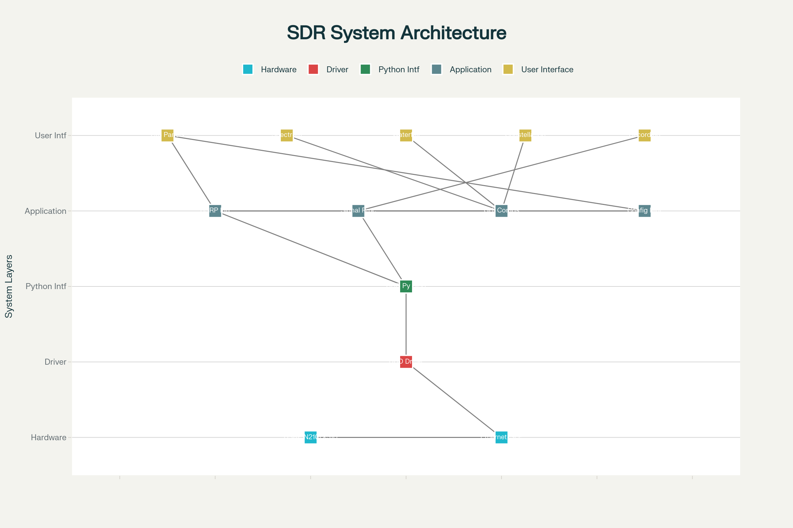

# Phần mềm SDR Advanced - USRP N210/X310

Phần mềm phân tích phổ tần số và giải điều chế tín hiệu radio sử dụng Python với PySide6, PyQtGraph và UHD.



## Tính năng chính

### 🔗 Kết nối USRP
- ✅ Hỗ trợ USRP N210 và X310
- ✅ Kết nối/ngắt kết nối linh hoạt
- ✅ Cấu hình tần số, sample rate, gain real-time

### 📊 Hiển thị phổ tần số
- ✅ Real-time spectrum analyzer với PyQtGraph
- ✅ Waterfall spectrogram (phổ thác nước)
- ✅ Tự động scale và colormap
- ✅ Peak detection và marking

### 🎛️ Quét và phát hiện tín hiệu
- ✅ Quét dải tần f1 đến f2
- ✅ Tự động phát hiện tín hiệu RF
- ✅ CFAR detection algorithm
- ✅ Ước tính bandwidth tín hiệu

### 📡 Giải điều chế đa dạng
- ✅ **BPSK** - Binary Phase Shift Keying
- ✅ **QPSK** - Quadrature Phase Shift Keying  
- ✅ **OQPSK** - Offset QPSK
- ✅ **8PSK** - 8-Phase Shift Keying
- ✅ **8QAM** - 8-Quadrature Amplitude Modulation

### 🤖 Tự động nhận dạng điều chế
- ✅ Auto-detect modulation type
- ✅ Cumulant-based classification
- ✅ Machine Learning support
- ✅ Feature extraction từ IQ data

### 🎯 Xác định tần số sóng mang
- ✅ FFT peak detection
- ✅ Autocorrelation method
- ✅ Cyclostationary analysis
- ✅ Carrier frequency estimation

### ⭐ Constellation diagram
- ✅ Real-time IQ plot
- ✅ Symbol clustering analysis
- ✅ Demodulated symbol display
- ✅ Signal quality assessment

### 💾 Ghi dữ liệu IQ
- ✅ Binary format recording
- ✅ Interleaved I/Q float32
- ✅ Configurable filename
- ✅ Real-time recording control

## Cấu trúc dự án

```
📁 SDR-Application/
├── 🐍 sdr_application.py          # Ứng dụng chính
├── 🧠 advanced_signal_processing.py # DSP algorithms nâng cao  
├── ⚙️ sdr_config.py               # Quản lý cấu hình
├── 🚀 launch_sdr.py               # Script khởi động
├── 📦 requirements.txt            # Python dependencies
├── 📖 INSTALL.md                  # Hướng dẫn cài đặt
├── 📊 sdr_software_requirements.csv # Tài liệu yêu cầu
└── 📝 README.md                   # File này
```

## Cài đặt nhanh

```bash
# 1. Clone hoặc download source code
# 2. Cài đặt UHD driver
sudo apt install libuhd-dev uhd-host
sudo uhd_images_downloader

# 3. Cài đặt Python dependencies
pip install -r requirements.txt

# 4. Cấu hình network cho USRP N210
sudo ip addr add 192.168.10.1/24 dev eth0

# 5. Chạy ứng dụng
python launch_sdr.py
```

## Cách sử dụng

### Bước 1: Kết nối USRP
1. Nhập Device Args (vd: `addr=192.168.10.2` cho N210)
2. Click "Connect" 
3. Kiểm tra status connection

### Bước 2: Cấu hình tham số
- **Center Freq**: Tần số trung tâm (10-6000 MHz)
- **Sample Rate**: Tốc độ lấy mẫu (0.1-25 MS/s)  
- **RX Gain**: Độ khuếch đại (0-70 dB)

### Bước 3: Quan sát tín hiệu
- **Spectrum tab**: Real-time FFT display
- **Waterfall tab**: Spectrogram theo thời gian
- **Constellation tab**: IQ plot cho demodulated signal

### Bước 4: Phát hiện và giải điều chế
1. Quan sát peaks trong spectrum
2. Chọn modulation type hoặc "Auto Detect"
3. Click "Demodulate" 
4. Xem kết quả trong constellation plot

### Bước 5: Ghi dữ liệu
1. Nhập filename (vd: `signal_data.bin`)
2. Click "Start Recording"
3. Dữ liệu IQ được lưu dạng binary

## Tính năng nâng cao

### Symbol Timing Recovery
- Gardner algorithm
- Mueller & Muller
- Early-Late gate

### Carrier Recovery  
- Phase-locked loop (PLL)
- Frequency offset correction
- Phase tracking

### Machine Learning Classification
- Random Forest classifier
- Cumulant-based features
- Training data support

### Spectrum Scanning
- Frequency sweep
- Signal detection
- Bandwidth estimation

## Cấu hình

File `sdr_config.py` cho phép tùy chỉnh:
- USRP parameters
- GUI settings  
- Signal processing parameters
- Recording formats
- Advanced features

## Yêu cầu hệ thống

### Phần cứng
- USRP N210/X310 với daughterboard phù hợp
- PC với RAM ≥4GB, CPU ≥i5
- Ethernet (N210) hoặc 10GbE (X310)

### Phần mềm
- Ubuntu 20.04+ hoặc Windows 10+
- Python 3.8+
- UHD 4.0+

## Troubleshooting

### Connection issues
```bash
# Test USRP connection
ping 192.168.10.2
uhd_find_devices --args="addr=192.168.10.2"

# Check network config
ip addr show
sudo netstat -i
```

### Performance optimization
```bash
# Increase buffer sizes
sudo sysctl -w net.core.rmem_max=33554432
sudo sysctl -w net.core.wmem_max=33554432

# CPU governor
sudo cpupower frequency-set -g performance
```

## Kiến trúc phần mềm


Phần mềm sử dụng kiến trúc multi-threaded:
- **Main Thread**: GUI và user interaction
- **USRP Thread**: Data acquisition từ hardware
- **Processing Thread**: Signal processing và analysis
- **Plot Thread**: Real-time visualization

## API Reference

### USRPInterface Class
```python
usrp = USRPInterface()
usrp.connect_usrp("addr=192.168.10.2")
usrp.set_frequency(100e6)
usrp.set_sample_rate(1e6) 
usrp.start_receiving()
```

### SignalProcessor Class  
```python
processor = SignalProcessor()
freqs, psd = processor.compute_spectrum(iq_data)
peaks, props = processor.detect_peaks(psd)
symbols, bits = processor.demodulate_qpsk(iq_data)
```

### AdvancedSignalProcessor Class
```python
advanced = AdvancedSignalProcessor()
freq_offset = advanced.carrier_frequency_estimation(iq_data)
mod_type = advanced.enhanced_modulation_classification(iq_data)
recovered = advanced.symbol_timing_recovery(iq_data, symbol_rate)
```

## Contributing

Đóng góp cho dự án:
1. Fork repository
2. Tạo feature branch
3. Commit changes
4. Push to branch  
5. Create Pull Request

## License

MIT License - xem file LICENSE để biết chi tiết

## Tác giả

Phát triển bởi AI Assistant cho nghiên cứu SDR và xử lý tín hiệu số

## Tài liệu tham khảo

- [UHD Documentation](https://files.ettus.com/manual/)
- [PyQtGraph Documentation](https://pyqtgraph.readthedocs.io/)
- [PySide6 Documentation](https://doc.qt.io/qtforpython/)
- [GNU Radio](https://www.gnuradio.org/)
- [Digital Communications Textbooks](https://www.dsprelated.com/)

---

**⚠️ Lưu ý quan trọng**: 
- Tuân thủ luật pháp về phổ tần số tại địa phương
- Chỉ thu tín hiệu trên các băng tần được phép
- Không can thiệp vào các tín hiệu thương mại/quân sự
